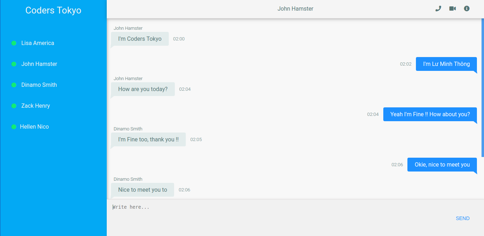
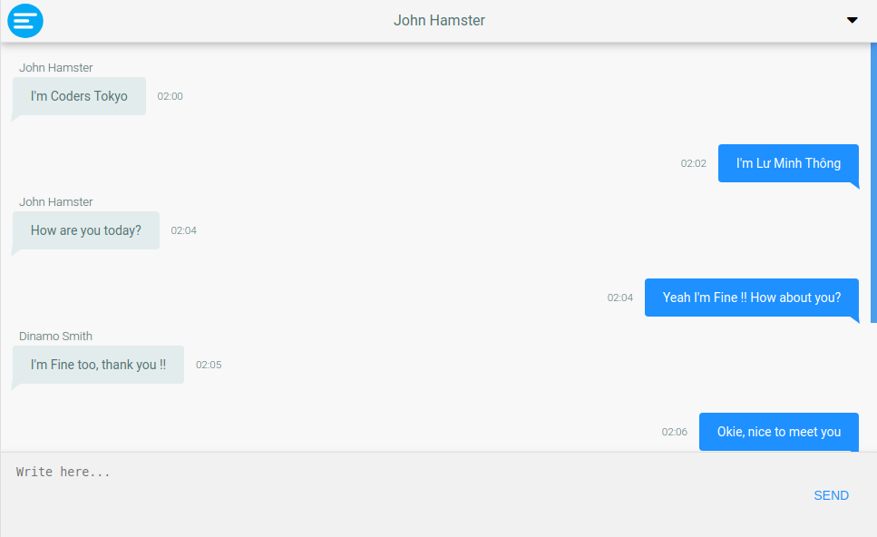
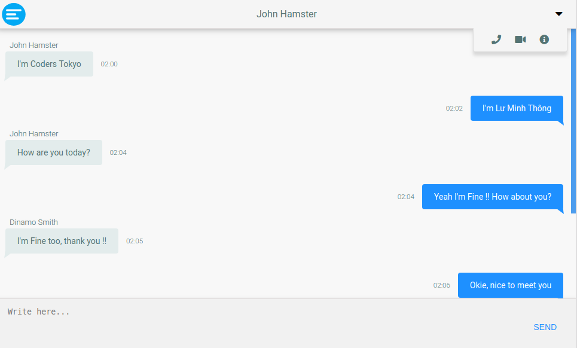
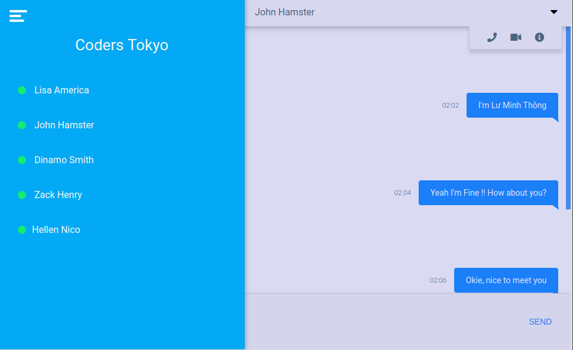
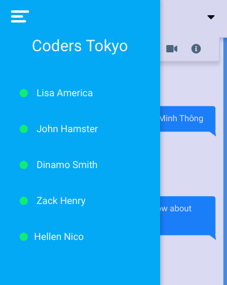

# CodersTokyo-Chat
**Author** : Lmint - Lư Minh Thông

Bản quyền sản phẩm thuộc về cộng đồng **Coders Tokyo**

Tham gia học lập trình miễn phí tại: https://coders.tokyo/tuts

## JSFiddle Source Code
Bạn có thể xem Source Code tại Link JSFiddle dưới đây.

https://jsfiddle.net/luminhthong/7emhpj1a/17/

## Live Demo
https://lmint3010.github.io/coders-tokyo-chat/

### Responsive Site
Trang web có khả năng tự sắp xếp và co dãn nội dung để tương thích mọi màn hình thiết bị khác nhau.

Hiển thị trên màn hình máy tính

Hiển thị trên màn hình máy tính bảng và điện thoại

